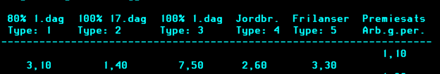

# Forsikring

Denne appen svarer ut som en bruker har kjøpt forsikring av Nav. Dette er bare aktuelt for selvstendig næringsdrivende.

Det er fire forskjellige typer forsikringer dennne appen finner svar om. De er ligger som type 1 til 4 i dataen fra Infotrygd. 
Hva de tallene betyr vises i dette skjermbildet:

- Type 1: 80 % dekningsgrad fra dag 1.
- Type 2: 100 % dekningsgrad fra dag 17.
- Type 3: 100 % dekningsgrad fra dag 1.
- Type 4: 100 % dekningsgrad fra dag 17, spesifikt for jordbrukere. Disse har allerede kollektiv forsikring som gir de 100 % dekningsgrad fra dag 17, så dette er en ekstra forsikring som gir de 100 % dekningsgrad fra dag 1.
- Type 5: Denne er ikke tatt hensyn til, da vi ikke har støtte for Frilansere i Spleis/Speil enda.

Tallene under hver type viser prosent av premiegrunnlaget forsikringen koster i 2025. Disse oppdateres hvert år, så de endres.